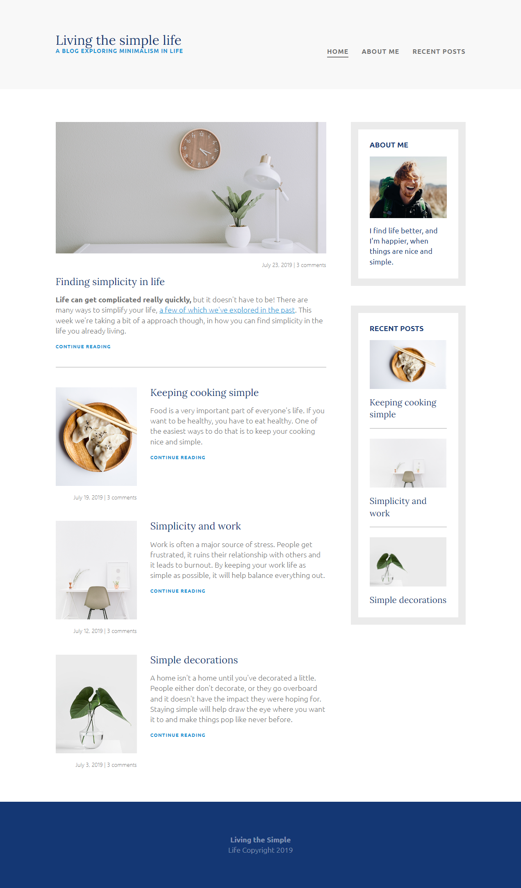

# Leverage the power of Flexbox on a three-page Blog

This is a solution to one of many exercises from Kevin Powell at [Learn Responsive Web Design](https://scrimba.com/learn/responsive).

## Table of contents

- [Overview](#overview)
  - [The challenge](#the-challenge)
  - [Screenshot](#screenshot)
    - [Desktop view](#desktop-view)
    - [Mobile view](#mobile-view)
  - [Links](#links)
- [My process](#my-process)
  - [Built with](#built-with)
  - [What I learned](#what-i-learned)
- [Author](#author)
- [Acknowledgments](#acknowledgments)

## Overview

### The challenge

Author should:

- Provide a perfectly responsive design for users to view the optimal layout depending on their device's screen size
- Stick to flexbox only

### Screenshot

#### Desktop view

===

===

#### Mobile view

===

===

### Links

- Solution URL: [Add solution URL here](https://your-solution-url.com)
- Live Site URL: [Add live site URL here](https://your-live-site-url.com)

## My process

### Built with

- Semantic HTML5 markup
- CSS custom properties
- Flexbox
- Mobile-first workflow

### What I learned

The power and simplicity of flexbox.

## Author

- Website - [Add your name here](https://www.your-site.com)
- Frontend Mentor - [@yourusername](https://www.frontendmentor.io/profile/yourusername)
- Twitter - [@yourusername](https://www.twitter.com/yourusername)

**Note: Delete this note and add/remove/edit lines above based on what links you'd like to share.**

## Acknowledgments

Thank you to [Scrimba](https://scrimba.com/dashboard#overview) and to [Mr Kevin Powell](https://www.youtube.com/kepowob) a **geniously talkative gifted teacher** at Scrimba.
