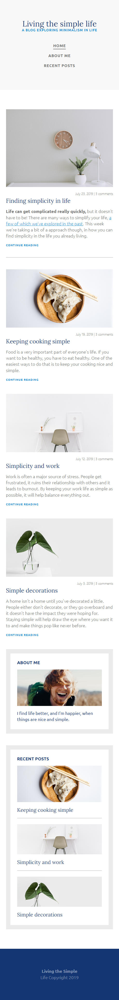

# Leverage the power of Flexbox on a three-page Blog

This is a solution to one of many exercises from Kevin Powell at [Learn Responsive Web Design](https://scrimba.com/learn/responsive).

## Table of contents

- [Overview](#overview)
  - [The challenge](#the-challenge)
  - [Screenshot](#screenshot)
    - [Desktop view](#desktop-view)
    - [Mobile view](#mobile-view)
  - [Links](#links)
- [My process](#my-process)
  - [Built with](#built-with)
  - [What I learned](#what-i-learned)
- [Author](#author)
- [Acknowledgments](#acknowledgments)

## Overview

### The challenge

Author should:

- Provide a perfectly responsive design for users to view the optimal layout depending on their device's screen size
- Stick to flexbox only

### Screenshot

#### Desktop view

___

___

#### Mobile view

___

___

### Links

- Live Site URL: [Simple life Blog](https://matondo99.github.io/simple-life-blog/index.html)

## My process

### Built with

- Semantic HTML5 markup
- CSS custom properties
- Flexbox
- Mobile-first workflow

### What I learned

The power and simplicity of flexbox.

## Author

- Github - [Astar Bahouidi](https://github.com/Matondo99)
- Frontend Mentor - [@Matondo99](https://www.frontendmentor.io/profile/Matondo99)

## Acknowledgments

Thank you to [Scrimba](https://scrimba.com/dashboard#overview) and to [Mr Kevin Powell](https://www.youtube.com/kepowob) a **geniously talkative gifted teacher** at Scrimba.
